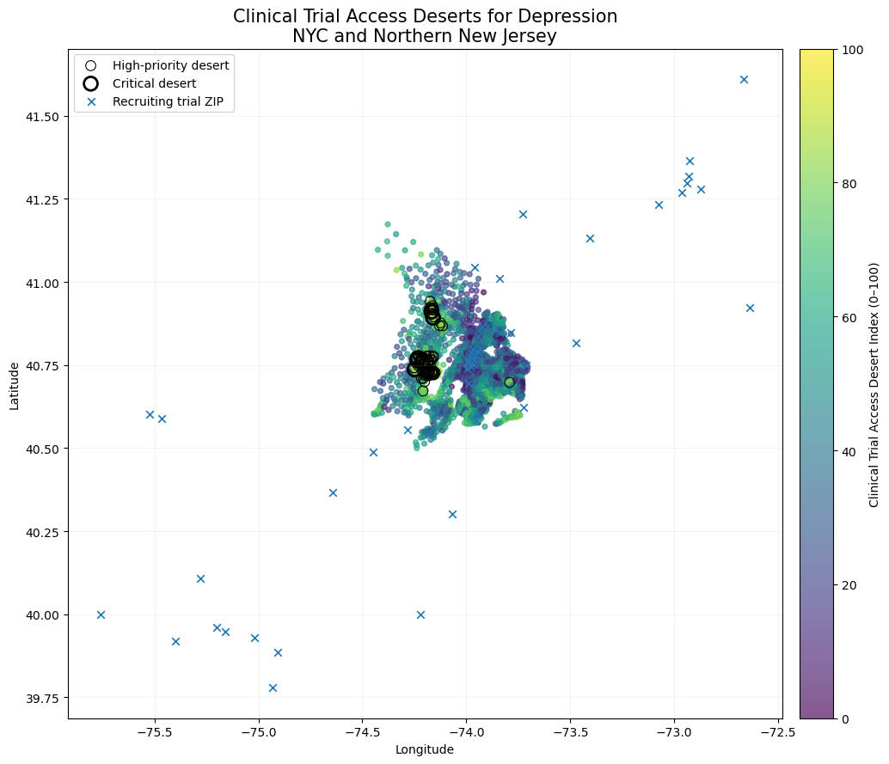

# Clinical Trial Access Desert Index (CTADI)

### Identifying where depression burden, socioeconomic vulnerability, and limited clinical-trial access intersect across the NYC–Northern New Jersey region



## Overview

Clinical trials are often concentrated around large academic medical centers, but communities with the greatest health needs may not live near those research opportunities.

I developed the **Clinical Trial Access Desert Index (CTADI)** to identify communities where high depression-related population need overlaps with poor geographic access to actively recruiting depression clinical trials.

The analysis integrates:

- ClinicalTrials.gov recruiting trial locations
- CDC PLACES modeled depression prevalence
- U.S. Census American Community Survey socioeconomic indicators
- Census-tract geographic coordinates
- Spatial accessibility and site-location optimization

The project evaluates **3,025 census tracts across New York City and Northern New Jersey** and then identifies where an additional recruiting trial site could produce the greatest improvement in access.

---

## Research Question

**Where are communities with high depression-related population need but limited geographic access to actively recruiting depression clinical trials, and where should an additional trial site be located to reduce those disparities?**

---

## Key Findings

### 1. Population need and clinical-trial access follow different geographic patterns

Depression-related population need was concentrated heavily in parts of **Manhattan and the Bronx**, while the greatest trial-access disadvantage occurred in **Northern New Jersey**.

The correlation between population need and trial-access disadvantage was:

**r = -0.350**

This suggests that communities with greater need do not necessarily experience worse trial access, reinforcing the importance of measuring both dimensions simultaneously.

---

### 2. Essex and Passaic Counties emerged as the strongest clinical-trial access deserts

The final CTADI identified Northern New Jersey as the region where high population need and limited trial access most strongly intersected.

| County | Mean CTADI | % of Tracts in Regional Top 10% | High-Priority Deserts | Critical Deserts |
|---|---:|---:|---:|---:|
| Essex County, NJ | 65.7 | 51.0% | 45 | 6 |
| Passaic County, NJ | 64.4 | 42.9% | 16 | 2 |
| Union County, NJ | 51.9 | 19.3% | 1 | 0 |

All **8 critical clinical-trial desert tracts** were located in Essex or Passaic County.

---

### 3. Clinical-trial access was highly uneven across the region

Across all study tracts:

- Median distance to the nearest recruiting trial location: **3.3 miles**
- 90th percentile distance: **9.4 miles**
- Maximum distance: **24.5 miles**
- **924 tracts** had no recruiting depression trial within 5 miles
- **253 tracts** had no recruiting depression trial within 10 miles

No tract was more than 25 miles from a recruiting trial, demonstrating why a simple 25-mile binary definition of a clinical-trial desert would not have meaningfully differentiated communities in this metropolitan region.

---

### 4. Eight census tracts met the strictest "critical desert" definition

A critical desert was defined as a tract simultaneously in the:

- top 10% of regional population need, and
- top 10% of regional trial-access disadvantage.

All eight critical tracts had:

- population-need percentiles above 91
- zero recruiting depression trials within 10 miles
- approximately 10–13 miles to the nearest recruiting location

Six were located in **Essex County** and two in **Passaic County**.

---

## CTADI Methodology

The final index consists of two major domains:

### 1. Population Need

Population need combines:

#### Depression burden

Depression burden incorporates:

- CDC PLACES modeled adult depression prevalence
- estimated number of adults with depression within each tract

These two measures were percentile-ranked and equally weighted.

#### Socioeconomic vulnerability

Five ACS indicators were used:

- poverty
- households without a vehicle
- uninsured population
- households without internet access
- low median household income

Each indicator was converted to a regional vulnerability percentile.

The five components were equally weighted to produce a **Socioeconomic Vulnerability Score**.

The final Population Need score was:

```text
Population Need =
0.50 × Depression Burden
+
0.50 × Socioeconomic Vulnerability
