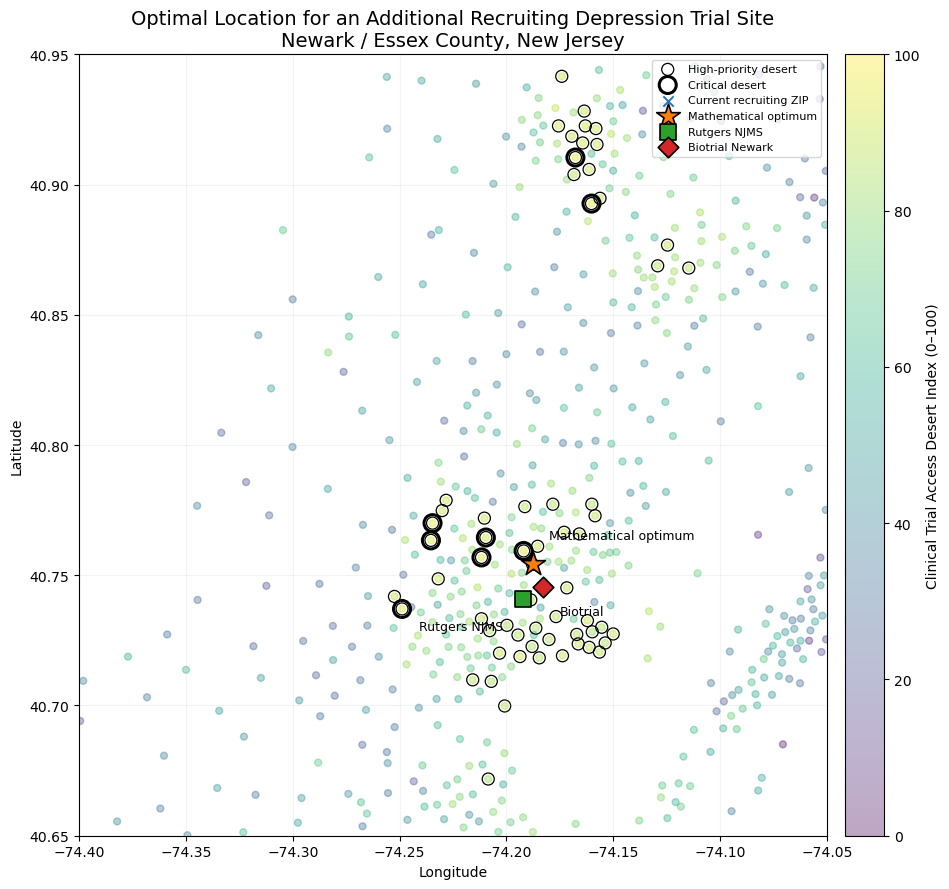

# Clinical Trial Access Desert Index (CTADI)

### Identifying where depression burden, socioeconomic vulnerability, and limited clinical-trial access intersect across the NYC–Northern New Jersey region


## Overview

Clinical trials are often concentrated around large academic medical centers, but communities with the greatest health needs may not live near those research opportunities.

I developed the **Clinical Trial Access Desert Index (CTADI)** to identify communities where high depression-related population need overlaps with poor geographic access to actively recruiting depression clinical trials.

The analysis integrates:

- ClinicalTrials.gov recruiting trial locations
- CDC PLACES modeled depression prevalence
- U.S. Census American Community Survey socioeconomic indicators
- Census-tract geographic coordinates
- Spatial accessibility and site-location optimization

The project evaluates **3,025 census tracts across New York City and Northern New Jersey** and then identifies where an additional recruiting trial site could produce the greatest improvement in access.

---

## Research Question

**Where are communities with high depression-related population need but limited geographic access to actively recruiting depression clinical trials, and where should an additional trial site be located to reduce those disparities?**

---

## Key Findings

### 1. Population need and clinical-trial access follow different geographic patterns

Depression-related population need was concentrated heavily in parts of **Manhattan and the Bronx**, while the greatest trial-access disadvantage occurred in **Northern New Jersey**.

The correlation between population need and trial-access disadvantage was:

**r = -0.350**

This suggests that communities with greater need do not necessarily experience worse trial access, reinforcing the importance of measuring both dimensions simultaneously.

---

### 2. Essex and Passaic Counties emerged as the strongest clinical-trial access deserts

The final CTADI identified Northern New Jersey as the region where high population need and limited trial access most strongly intersected.

| County | Mean CTADI | % of Tracts in Regional Top 10% | High-Priority Deserts | Critical Deserts |
|---|---:|---:|---:|---:|
| Essex County, NJ | 65.7 | 51.0% | 45 | 6 |
| Passaic County, NJ | 64.4 | 42.9% | 16 | 2 |
| Union County, NJ | 51.9 | 19.3% | 1 | 0 |

All **8 critical clinical-trial desert tracts** were located in Essex or Passaic County.

---

### 3. Clinical-trial access was highly uneven across the region

Across all study tracts:

- Median distance to the nearest recruiting trial location: **3.3 miles**
- 90th percentile distance: **9.4 miles**
- Maximum distance: **24.5 miles**
- **924 tracts** had no recruiting depression trial within 5 miles
- **253 tracts** had no recruiting depression trial within 10 miles

No tract was more than 25 miles from a recruiting trial, demonstrating why a simple 25-mile binary definition of a clinical-trial desert would not have meaningfully differentiated communities in this metropolitan region.

---

### 4. Eight census tracts met the strictest "critical desert" definition

A critical desert was defined as a tract simultaneously in the:

- top 10% of regional population need, and
- top 10% of regional trial-access disadvantage.

All eight critical tracts had:

- population-need percentiles above 91
- zero recruiting depression trials within 10 miles
- approximately 10–13 miles to the nearest recruiting location

Six were located in **Essex County** and two in **Passaic County**.

---

## CTADI Methodology

The final index consists of two major domains:

### 1. Population Need

Population need combines:

#### Depression burden

Depression burden incorporates:

- CDC PLACES modeled adult depression prevalence
- estimated number of adults with depression within each tract

These two measures were percentile-ranked and equally weighted.

#### Socioeconomic vulnerability

Five ACS indicators were used:

- poverty
- households without a vehicle
- uninsured population
- households without internet access
- low median household income

Each indicator was converted to a regional vulnerability percentile.

The five components were equally weighted to produce a **Socioeconomic Vulnerability Score**.

The final Population Need score was:

```text


?
That’s okay — it probably means the README version you pasted didn’t include that later section.
Easiest fix: just add Figure 2 anywhere sensible near the bottom.

In README.md, click the pencil, then scroll to the section where you talk about the optimal site location / Newark / site-location optimization. Right after that section, paste this:

## Real-World Site Comparison



The site-location optimization identified central Newark, New Jersey, as the highest-impact area for an additional recruiting depression-trial site.

Two existing research-capable facilities near the mathematical optimum were evaluated:

| Candidate Site | % of Theoretical Optimal Impact | High-Priority Tracts Improved | Critical Deserts Within 5 Miles |
|---|---:|---:|---:|
| Mathematical optimum | 100.0% | 61 | 6 |
| Biotrial Newark | 99.1% | 60 | 6 |
| Rutgers NJMS Clinical Research Unit | 98.0% | 58 | 6 |
Then commit with:
Add Newark site-placement figure
That will create the missing section and display Figure 2.
should I add a later section
Yes. That’s actually cleaner.
Keep Figure 1 near the top as the main regional result, and add Figure 2 later under a dedicated section after your Site-Location Optimization / Optimal Site Location discussion.

Use this section:

## Real-World Site Comparison


The site-location optimization identified central Newark, New Jersey, as the highest-impact area for an additional recruiting depression-trial site.

Two existing research-capable facilities near the mathematical optimum were evaluated:

| Candidate Site | % of Theoretical Optimal Impact | High-Priority Tracts Improved | Critical Deserts Within 5 Miles |
|---|---:|---:|---:|
| Mathematical optimum | 100.0% | 61 | 6 |
| Biotrial Newark | 99.1% | 60 | 6 |
| Rutgers NJMS Clinical Research Unit | 98.0% | 58 | 6 |
That placement tells the story better: first show where the deserts are, then later show what to do about them.
this is all I have: # Clinical Trial Access Desert Index (CTADI)

### Identifying where depression burden, socioeconomic vulnerability, and limited clinical-trial access intersect across the NYC–Northern New Jersey region


## Overview

Clinical trials are often concentrated around large academic medical centers, but communities with the greatest health needs may not live near those research opportunities.

I developed the **Clinical Trial Access Desert Index (CTADI)** to identify communities where high depression-related population need overlaps with poor geographic access to actively recruiting depression clinical trials.

The analysis integrates:

- ClinicalTrials.gov recruiting trial locations
- CDC PLACES modeled depression prevalence
- U.S. Census American Community Survey socioeconomic indicators
- Census-tract geographic coordinates
- Spatial accessibility and site-location optimization

The project evaluates **3,025 census tracts across New York City and Northern New Jersey** and then identifies where an additional recruiting trial site could produce the greatest improvement in access.

---

## Research Question

**Where are communities with high depression-related population need but limited geographic access to actively recruiting depression clinical trials, and where should an additional trial site be located to reduce those disparities?**

---

## Key Findings

### 1. Population need and clinical-trial access follow different geographic patterns

Depression-related population need was concentrated heavily in parts of **Manhattan and the Bronx**, while the greatest trial-access disadvantage occurred in **Northern New Jersey**.

The correlation between population need and trial-access disadvantage was:

**r = -0.350**

This suggests that communities with greater need do not necessarily experience worse trial access, reinforcing the importance of measuring both dimensions simultaneously.

---

### 2. Essex and Passaic Counties emerged as the strongest clinical-trial access deserts

The final CTADI identified Northern New Jersey as the region where high population need and limited trial access most strongly intersected.

| County | Mean CTADI | % of Tracts in Regional Top 10% | High-Priority Deserts | Critical Deserts |
|---|---:|---:|---:|---:|
| Essex County, NJ | 65.7 | 51.0% | 45 | 6 |
| Passaic County, NJ | 64.4 | 42.9% | 16 | 2 |
| Union County, NJ | 51.9 | 19.3% | 1 | 0 |

All **8 critical clinical-trial desert tracts** were located in Essex or Passaic County.

---

### 3. Clinical-trial access was highly uneven across the region

Across all study tracts:

- Median distance to the nearest recruiting trial location: **3.3 miles**
- 90th percentile distance: **9.4 miles**
- Maximum distance: **24.5 miles**
- **924 tracts** had no recruiting depression trial within 5 miles
- **253 tracts** had no recruiting depression trial within 10 miles

No tract was more than 25 miles from a recruiting trial, demonstrating why a simple 25-mile binary definition of a clinical-trial desert would not have meaningfully differentiated communities in this metropolitan region.

---

### 4. Eight census tracts met the strictest "critical desert" definition

A critical desert was defined as a tract simultaneously in the:

- top 10% of regional population need, and
- top 10% of regional trial-access disadvantage.

All eight critical tracts had:

- population-need percentiles above 91
- zero recruiting depression trials within 10 miles
- approximately 10–13 miles to the nearest recruiting location

Six were located in **Essex County** and two in **Passaic County**.

---

## CTADI Methodology

The final index consists of two major domains:

### 1. Population Need

Population need combines:

#### Depression burden

Depression burden incorporates:

- CDC PLACES modeled adult depression prevalence
- estimated number of adults with depression within each tract

These two measures were percentile-ranked and equally weighted.

#### Socioeconomic vulnerability

Five ACS indicators were used:

- poverty
- households without a vehicle
- uninsured population
- households without internet access
- low median household income

Each indicator was converted to a regional vulnerability percentile.

The five components were equally weighted to produce a **Socioeconomic Vulnerability Score**.

The final Population Need score was:

text
Yep — you’re just missing the second half of the README. Paste the following directly after:
The final Population Need score was:

Use this whole continuation:

```text
Population Need =
0.50 × Depression Burden
+
0.50 × Socioeconomic Vulnerability
```

---

### 2. Trial Access Disadvantage

Trial accessibility was evaluated using standardized recruiting-site ZIP centroids.

Two components were used:

- distance to the nearest actively recruiting depression-trial location
- number of distinct recruiting depression trials within 10 miles

The Trial Access Disadvantage score was:

```text
Access Disadvantage =
0.50 × Nearest-Site Distance Disadvantage
+
0.50 × Trial-Opportunity Disadvantage
```

Higher scores represent poorer access.

---

## Final Clinical Trial Access Desert Index

Because the concept of a clinical-trial desert requires both **high need** and **poor access**, the primary CTADI uses the geometric mean of regional percentiles:

```text
CTADI =
sqrt(
    Population Need Percentile
    ×
    Trial Access Disadvantage Percentile
)
```

Higher CTADI values indicate a stronger combination of:

- depression-related population need
- socioeconomic vulnerability
- geographic distance from recruiting trials
- limited nearby recruiting opportunities

A conventional equal-weight arithmetic index was also calculated as a sensitivity analysis.

The correlation between the geometric CTADI and additive sensitivity score was:

**r = 0.913**

This indicates that the main geographic findings were robust to an alternative index specification.

---

## Clinical Trial Desert Classification

In addition to the continuous CTADI score, two stricter classifications were created.

### High-Priority Desert

A tract simultaneously in the:

- top 20% of Population Need
- top 20% of Trial Access Disadvantage

**63 tracts** met this definition.

### Critical Desert

A tract simultaneously in the:

- top 10% of Population Need
- top 10% of Trial Access Disadvantage

**8 tracts** met this definition.

All eight critical deserts were located in **Essex and Passaic Counties, New Jersey**.

---

## Regional CTADI Map


Higher CTADI values represent greater combined population need and trial-access disadvantage.

The regional map demonstrates that areas with high depression-related need are not necessarily the same communities experiencing the greatest geographic barriers to recruiting clinical trials.

---

## Site-Location Optimization

The analysis next asked:

> **If one additional recruiting depression-trial site could be opened, where would it produce the greatest reduction in unmet access?**

All **3,025 scored census-tract centroids** were evaluated as potential new-site locations.

The primary optimization targeted the **63 high-priority desert tracts** and maximized the need-weighted reduction in distance to the nearest recruiting trial location.

The weighting incorporated:

- estimated number of adults with depression
- Population Need percentile

### Optimal Geographic Target

The mathematical optimum was identified in **central Newark / Essex County, New Jersey**.

The theoretical location would:

- improve nearest-site access for **61 of 63 high-priority desert tracts**
- place **45 of 63** high-priority deserts within 5 miles of a recruiting site
- place **52 of 63** within 10 miles
- place **6 of 8 critical deserts** within 5 miles
- place **7 of 8 critical deserts** within 10 miles

A sensitivity analysis restricted to the eight critical deserts selected a location approximately **1.35 miles from the primary optimum**, supporting the geographic robustness of the result.

---

## Real-World Site Comparison


The theoretical optimum was then compared with existing research-capable facilities in Newark.

| Candidate Site | % of Theoretical Optimal Impact | High-Priority Tracts Improved | Critical Deserts Within 5 Miles |
|---|---:|---:|---:|
| Mathematical optimum | 100.0% | 61 | 6 |
| Biotrial Newark | 99.1% | 60 | 6 |
| Rutgers NJMS Clinical Research Unit | 98.0% | 58 | 6 |

Both real-world facilities preserved nearly all of the theoretical geographic benefit.

For a community-facing depression clinical trial, the **Rutgers New Jersey Medical School Clinical Research Unit** represents a particularly actionable implementation option because it combines near-optimal geographic impact with established clinical-research infrastructure.

For an early-phase pharmacologic trial, **Biotrial Newark** also represents a highly efficient potential location.

---

## Why This Matters

Traditional clinical-trial accessibility analyses may focus only on the number of sites or distance to the nearest research center.

CTADI instead asks whether research infrastructure is geographically aligned with communities experiencing the greatest need.

The analysis shows that **high disease burden alone does not identify a clinical-trial desert**.

Some high-need communities in Manhattan and the Bronx have comparatively strong trial access because of dense academic medical infrastructure.

In contrast, parts of Essex and Passaic Counties combine meaningful depression-related population need with substantially weaker access to recruiting trials.

This framework could help:

- clinical-trial sponsors identify more equitable recruitment locations
- health systems identify underserved research catchment areas
- researchers assess geographic representation
- policymakers identify gaps in clinical-research infrastructure

---

## Data Sources

### ClinicalTrials.gov
Used to identify actively recruiting depression-related clinical trials and their recruiting locations.

### CDC PLACES
Used for census-tract modeled adult depression prevalence.

### U.S. Census Bureau — American Community Survey
Used to derive census-tract socioeconomic vulnerability measures, including:

- poverty
- vehicle access
- insurance coverage
- internet access
- median household income

### Geographic Data
Census-tract coordinates and standardized ZIP centroids were used to calculate great-circle distances between communities and recruiting locations.

---

## Technical Methods

This project includes:

- REST API data retrieval
- JSON parsing
- data cleaning and validation
- record linkage
- feature engineering
- percentile-based composite index construction
- census-tract analysis
- Haversine distance calculations
- geographic accessibility analysis
- site-location optimization
- sensitivity analysis
- data visualization

---

## Tools

- Python
- pandas
- NumPy
- requests
- matplotlib
- ClinicalTrials.gov API
- CDC PLACES API
- American Community Survey
- Nominatim / OpenStreetMap
- ZIP-centroid geocoding

---

## Key Output Files

### `ctadi_final_tract_index.csv`
Final census-tract dataset containing Population Need, Trial Access Disadvantage, CTADI scores, percentiles, and desert classifications.

### `ctadi_final_county_summary.csv`
County-level CTADI results.

### `ctadi_critical_desert_tracts.csv`
The eight census tracts meeting the strict critical-desert definition.

### `ctadi_real_world_site_comparison.csv`
Comparison of the theoretical optimum with real Newark research facilities.

### `ctadi_new_site_candidate_ranking.csv`
Site-location optimization results across candidate census-tract centroids.

---

## Limitations

Several limitations should be considered when interpreting the index.

First, geographic proximity does not guarantee individual clinical-trial eligibility. Each trial has specific inclusion and exclusion criteria.

Second, accessibility was modeled using straight-line geographic distance rather than actual driving or public-transit travel time.

Third, ClinicalTrials.gov recruiting status is dynamic and trial locations may open, close, or stop recruiting over time.

Fourth, socioeconomic indicators and modeled depression prevalence represent population-level characteristics and should not be interpreted as individual-level attributes.

Fifth, ZIP centroids were used to standardize recruiting-site geography because many ClinicalTrials.gov facility names could not be reliably geocoded to exact buildings.

Finally, CTADI is a prioritization framework rather than a validated clinical or policy instrument.

---

## Future Work

Potential extensions include:

- public-transit and driving-time accessibility
- racial and ethnic representation
- trial eligibility modeling
- sponsor-specific recruitment patterns
- additional mental-health conditions
- optimization of multiple new trial sites
- national-scale application
- comparison with actual enrollment patterns
- optimization under budget or site-capacity constraints
Population Need =
0.50 × Depression Burden
+
0.50 × Socioeconomic Vulnerability
